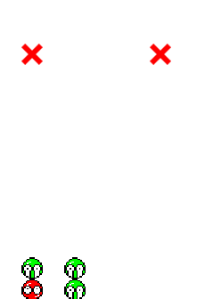

# Puyo AI
 an ai for puyo puyo - a puzzle / stacking game

# Approaching the problem

First things first, I was given code to a simple puyo puyo pygame implementation by [my brother](https://www.linkedin.com/in/ericjmleclair/).

Originally, I had been inspired by [a neural network that learned to play snake](https://www.youtube.com/watch?v=zIkBYwdkuTk), and used this sort of approach to another project (see my Antymology repo) - I didn't get the kind of results I had wanted, though, so I decided to try it with a simpler game: Puyo Puyo. 

## A bit about puyo

Puyo Puyo is originally a competitive game, where players stack blobs to earn points. A complex strategy in Puyo Puyo is creating large chains, where falling blocks connect with others after making a connection and 'bursting' - you can see an example of this [here](https://www.youtube.com/watch?v=UXNnO20vy-c).

My goal was to try and replicate this behaviour.

# The steps I took

1. First, I programmed a really basic neural network in Python.
2. I connected the game and the neural network, so that the neural network would 'control' the game. 
3. I let the AI loose, and tried to tune it to get consistently good scores.

## A glance at how it works

The system itself is fairly simple: the board is fed into the neural network as input, and the move that the AI should make is taken as output. 

## Making it better

The AI is trained through genetic operators. The idea behind genetic strategies in computer science is using some kind of fitness function to simulate a survival-of-the-fittest approach to problem solving. 

This of course, requires a gene pool, so I made the puyo game support a number of boards at 1 time.

At first, I made the fitness function the sum of all of the scores that a given player (AI) had produced until that point: this means that only the AIs that achieved good results (ie: got a higher score) would survive, with new generations being formed off of their basis.    

When a majority of the boards had lost their game, a new generation would be formed by:

- Copying the top half of fit players into the bottom half
- Performing mutations on the bottom half 
- Eventually I added in a crossover between the most fit players, to try and achieve a fine tuning effect.

I ended up playing with the fitness function a lot, and tried quite a few things to improve the performance of the AI. 

# Results and analysis 

Early on, with the additive model, I had managed to get some pretty decent results. I left it to train for a few hours, and already you could see some good results: 

The above image is two players, side by side. Looking at the first player, you can see that it appears to have at least a basic understanding of matching colours. 

This was not producing very complex chaining behaviour, so I added a multiplier to the score to favour longer chains. 

This is when things started to get really challenging - AIs that managed to get a chain by coincidence would become the most fit, and eventually the AI developed a strategy to chain: 

It would build up a big stack of puyos on one side of the board and try to trigger it by placing puyos in the open column. For the most part, this was pretty good for how simple the model was: I was using a neural network with 2 layers of 50 or so internal nodes. 

The problem with this is that it was pretty inconsistent: It seemed to just be hoping that whatever puyos it placed in the open column would produce some kind of good score, but this was pretty random - I wanted it to be sure of when and how to break the chain. 

And so, I adopted a model where the fitness of each player would be calculated based only on the score achieved for that iteration. 

Due to the mechanism that would start a new generation when most of the players finished, some of the better players would never get a chance to trigger their chains -- and so I got some really inconsistent results: 

To try and achieve a more consistently good AI, that could perform well no matter what puyos it was given, I toned down the chain multipler in the score a LOT.

 I also added a double ended queue that would be used to calculate the average of the most recent 50 scores each 'player' had produced, with the goal of toning down how much of an impact one really good chain could make, since the AI would usually rebound right back down to a low score as seen in the above graph.

 ### The results of these changes

I should note that after this point, I never changed the fitness score in order to see how the structure of the neural network would affect it's performance.

I gave the AI a few hours to train with these changes, and it produced the following results: 

It seemed to achieve the consistency I wanted, usually getting an average fitness of 2000 across 35 generations. I didn't let it run any further since it's improvement seemed to halt. 

To see if it could achieve better performance, I added some more complexity to the neural network: I changed the internal layers to be 2 layers of 150 internal nodes each.

My goal was achieved:

The AI was now able to achieve a better score across generations, capping out between 3000 and 4000, usually somewhere in the middle. 

As one last hurrah, I greatly increased the complexity of the neural network: the final shape of the internal nodes was (250, 250, 125, 125). 

I let this for quite a long time, since it was starting to run fairly slow at this point. 

Unfortunately, the results weren't much more impressive than the intermediate network just above.

You can see them here: 

Across 50 generations, It never really broke the 4000 score mark, but was also fairly inconsistent - with fitness dipping back down to the 2500-3000 score range. 

# Conclusion

As I did this in a few free days as the semester was heading into exam season, I decided to pack things up and focus on my classes. 

In the future (if I revisit this project), I would like to change how the network works: I would still feed the AI the position, but instead have it choose which column/arrangement to place the puyo in as opposed to having it make a move at every interval. This should not only speed up the training process, but hopefully produce some better results! 

Thanks for reading! :) 

# A last note: Running the code 

To run the code for yourself, you can clone this repo, navigate to the game folder and run: 

`python puyovisualizer.py`

Note that this uses the beefy mega model, so it will probably run quite slow. 

You might need to install:

- pygame
- sklearn (I used it to make some calculations)
- matplotlib, if you plan on plotting the results.  

